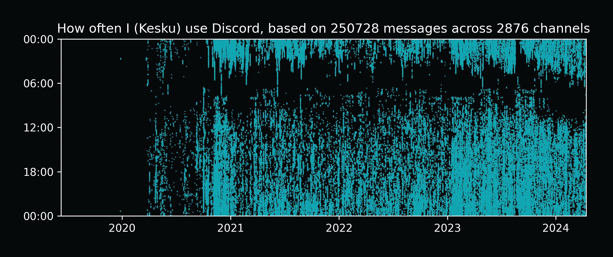
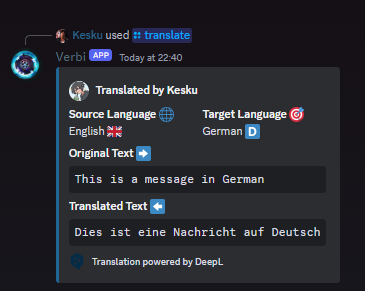
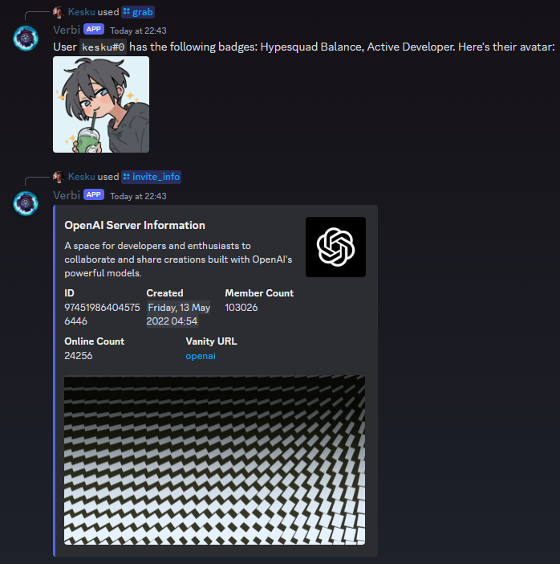
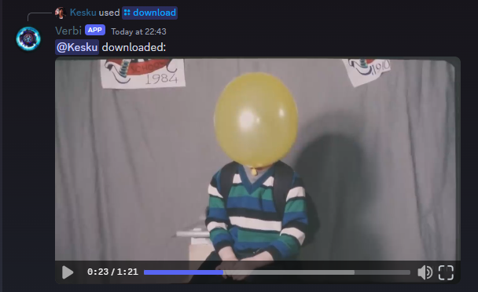
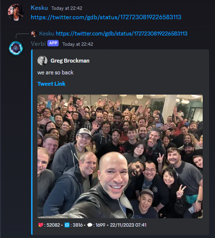
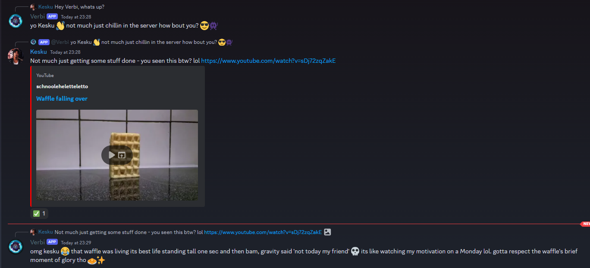

## Hey, it's kes again. I'm back with another post, reading it is not worth your time, but I'm glad you're here :)

I'm a huge fan of Discord, and I use it a lot. I hit the 200 server limit a while back and need to cut down every now and then, but it's hard to since I talk in most of them - and I'm only in like 3-4 emote servers, so I can't even cut those out. I'm also in a lot of tech servers, so I can't cut those out either. I'm in a lot of servers, okay?

### Oh yeah, I also moderate some servers!

Like [The OpenAI Discord](https://discord.gg/openai) - which is pretty cool. I applied back in Jan 2023 and got accepted on Valentines Day (aww <3). I've been moderating there ever since. I also moderate some other servers, but I won't go into those since they're not as cool as OpenAI (yes, I'm biased).

You can find me in places like OpenAI's server but also [Discord's Townhall](https://discord.gg/discord-townhall), [Nous Research](https://discord.gg/nousresearch), one of the r/Singularity servers (why are there two?) and a few others.
I'm also in a few servers that I won't mention here, but I'm sure you can find me if you look hard enough - or just ask me on Discord, my username is kesku

As you can tell, Discord is more than just a chat app for me, it's a significant part of my social life and tech journey. Managing my time across all these servers is a challenge, but it's worth it for the connections and knowledge I gain! You probably met me from either Twitter or Discord if you're reading this, so you know how much I love to spend time doing anything but studying.

Discord Scatter Plot [made by adryd325 on GitHub](https://gist.github.com/adryd325/f811e975bf8240fb6e6555e57c3db7d2)

### Discord bots are cool too

Bots, yeah.. I make those. I've made a few bots for servers I'm in, mainly for fun or to automate some tasks. I keep them private though (they're pretty shit)

Here's one of them, it's called Verbi and it's a bot I made for me & my friends. It's got a few features, like:

- /translate - input a phrase, pick a language, and get a translation via DeepL
  
   
- /grab and /invite_info - get info on Discord users and Discord servers
  
   
- /download - Downloads a video off of Twitter, TikTok, YouTube or Instagram and reuploads it to Discord
  
   
- Just straight up embedding tweets for me
  
   
- GPT-4 powered personality that you can talk to. As part of this it can understand images and, as of recently, YouTube videos
  

None of the above is impressive, but it's fun to have around. I'm thinking of adding more to it but I'm more focused on my _actual_ projects right now, blog posts on those soon (maybe).

That's all for now, I guess?

kes out
