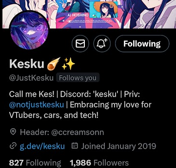
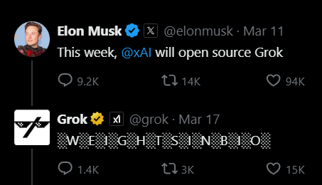

You're still here? I'm surprised, but hey, it's Kes! I'm back with another post, and this time it's about Twitter.. no I still won't call it X, no I don't care that Elon owns it now.

I've been using Twitter for a while now ([@yoimnotkesku](https://x.com/yoimnotkesku)), and I've got to say, it's pretty terrible. I've met a lot of cool people on there, and I've had some interesting conversations, but the platform itself is.. not great. I've been locked out of my account a few times, `@JustKesku` got suspended at 2000 followers, and I've had to deal with a lot of spam.

But I still use it, so.. can't be that bad?

## Twitter is.. interesting

I've been on Twitter since 2016, and I've seen a lot of changes. I was one of the unlucky souls who decided to join social media at a young age (still above TOS limits tho lol), so I've been through a lot of.. interesting phases. I don't even remember my first account but I do know my account was basicaly dedicated to [Love Live!](https://anilist.co/anime/15051/Love-Live-School-idol-project) and [Just Cause 3](https://store.steampowered.com/app/225540/Just_Cause_3/). I'd like to say I've grown since then, but I'm still a huge weeb and pretty fucking stupid, so I guess that isn't the case.

I'm just gonna go ahead and skip all the mundane stuff from 2016-2019 and jump straight to 2020, where I fell down into my first rabbit hole...

## VTubers, oh no

Unfortunately, I fell into the VTuber rabbit hole in 2020, and I've been stuck there ever since. It all started with _one_ song cover from [Kairi Tadase](https://www.youtube.com/@Kairi_Tadase) and now I'm in too deep. I've spent way too much money on merch, and I've watched way too many streams. I've even started watching anime again, which is.. not great for my productivity. If you're wondering why I don't do those "ML progress" tweets, _this is why_.

The cover I listened to was a BANGER though, would recommend:

Calc. by Kairi Tadase - [YouTube](https://www.youtube.com/watch?v=GRIm1nY54sc)

I've consistenly watched [Hololive](https://hololivepro.com/) and some indie VTubers too - some of my oomfs on twitter are VTubers, even [my girlfriend](https://x.com/Angry_Ann_) is a VTuber. I kinda love how some of the people in the AI/ML community are weebs too, makes me feel at home haha.

## Bots, bots, bots

I am so tired of bots on Twitter. I've had to deal with so many of them. I've made a few myself for fun, but those actually used the Twitter API (back when it was free). Nowadays it's always _NUDES-IN-BIO_ or some random link to some magical wizard that'll get your insta followers up, and I'm just tired of it.

Elon & the Twitter team even [make a joke out of it sometimes](https://x.com/grok/status/1769441648910479423), which is.. not great. I'm glad they're aware of the issue, but I wish they'd do something about it.

## Call it what you want, I still call it Twitter

I've had some interesting conversations on this site. I've even met some of my closest friends on there, and I'm grateful for that. Also had my fair share of popular tweets.. I am not proud of most of them.

Proud of this VTuber moment tho :>

I'm still on Twitter, and I'm still active. I'm not as active as I used to be, mainly because I'm on Discord.

I'm still tweeting, and I'm still interacting with people. Actually, I made a BUNCH of new friends recently, like [melano (@melqtx)](https://melqtx.github.io/) who has a blog that is way better than mine, [gion (@gi0nyx)](https://x.com/gi0nyx) who's been doing cool webdev and AI stuff, and [Lelouch (@lelouchdaily)](https://x.com/lelouchdaily) who's been documenting their journey into AI/ML every day!

If this blog post was helpful to you, **PLEASE** visit a nearby hospital.

kes out
