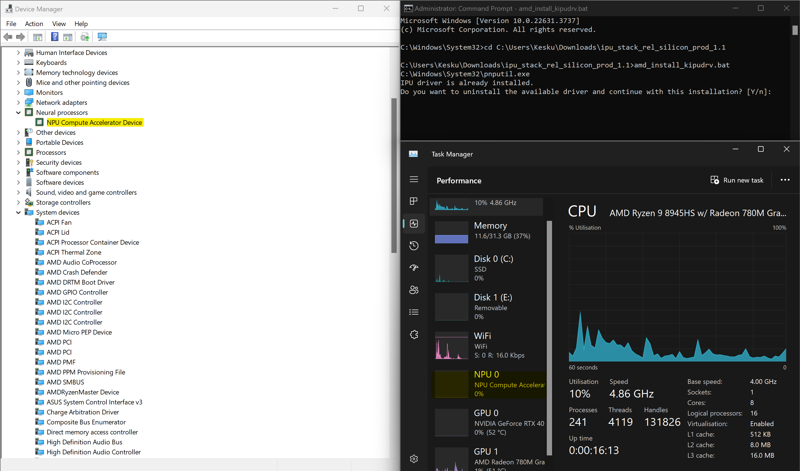
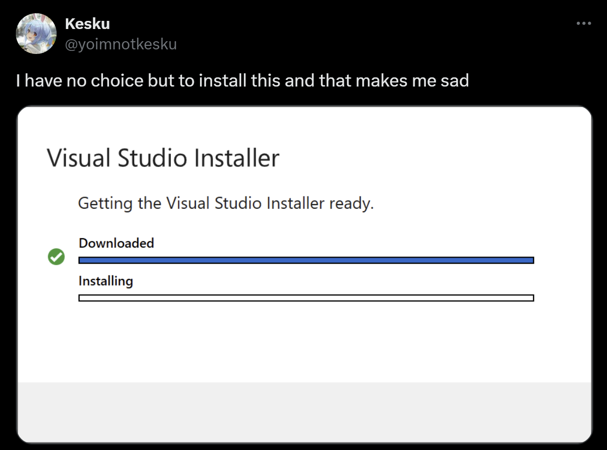
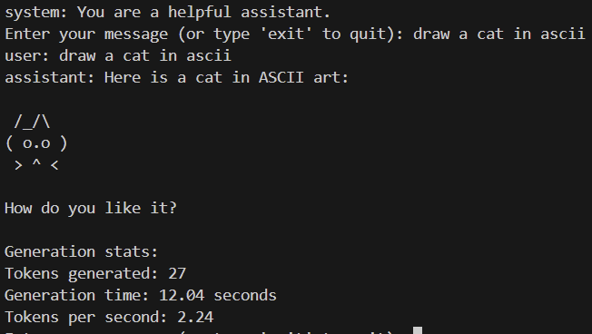

Hey, it's Kes!

I DEFINITELY didn't forget to write a blog post for 2 months shut up

This post is specific to my experiences with AMD RyzenAI NPUs, I still need to mess with the Neural Engine more, and my Copilot+ PC never arrived so I can't talk about that yet. I will be buying more tech to test, and am currently quantizing Llama-3-8B-Instruct to run on a Snapdragon 8 Gen 3, so I'll tweet about that soon.

## Neural Processing Units (NPUs) huh?

I think NPUs are cool. They're power efficient machine learning accelerators you can find built into other hardware (like your CPU, GPU or motherboard), designed to run small models fast and efficiently.

You used to see NPUs being called AI chips in smartphones just for fancier camera processing but with the LLM era, they're becoming more common everywhere else, along with being capable of running more complex models.

Here's a solid example - the Apple Neural Engine. It's an NPU Apple's had in their devices since the A11 Bionic chip, but was limited to apple-only stuff like [FaceID on the iPhone X](https://www.wired.com/story/apples-neural-engine-infuses-the-iphone-with-ai-smarts/).

With the A12 though, Apple opened up the NPU to developers via the [CoreML framework](https://developer.apple.com/documentation/coreml) since it was more powerful with 5 TOPs (Trillion Operations Per Second) compared to the A11's 600 billion operations per second.

This is why [iOS 18 requires an A12 chip or newer to run](https://www.apple.com/newsroom/2024/06/ios-18-makes-iphone-more-personal-capable-and-intelligent-than-ever/) - the Neural Engine is needed for some of the new AI stuff they introduced

Seems like I'm going to need to buy a couple iPhone 15s and 16s
Dear bank account, I'm sorry.

## So, time to get some NPUs

I picked up a couple laptops with AMD RyzenAI NPUs, some M series Macbooks with Apple's Neural Engine, and a few other devices with NPUs like snapdragon phones.

For starters I got a new daily laptop - an Asus Zephyrus G14 with a `Ryzen™ 9 8945HS` and `RTX 4070`. It's a pretty good laptop, I use it for most of my work now - but more importantly the CPU it has comes with a built-in _AMD Ryzen™ AI NPU_, that maxes out at 16 TOPs.

### "But Kes, you have a 4070 in there, why not use that for AI stuff?"

First of all, shut up, I like my NPU, it's cool. Second, the NPU is better for some stuff than the GPU.

The NPU is more power efficient and is built into the CPU, so it's better for on-device stuff - I won't need to run my GPU and waste power just to run a model like Meta's [llama 8b instruct](https://huggingface.co/meta-llama/Meta-Llama-3-8B-Instruct). Most importantly (imo) is the fact I'm **offloading** work from my CPU/GPU to the NPU.

This means I can run models without choking my GPU
So I can play games while I run models then - at least in theory...

## What can you do with a RyzenAI NPU?

Not much at first, since Microsoft really doesn't make the most out of them.

Here's the one and only trick you can do on Windows natively with an supported NPU: Studio Effects.

(I got this GIF from [Microsoft's AI page](https://learn.microsoft.com/en-us/windows/ai), no way I'm demoing this myself)

As you can see, all it does is some background blur and framing stuff. It's neat, but it's not really what I want to do with my NPU. Why would I buy a laptop with an NPU just to blur my background?

I was hoping to use the [Cocreator feature in Paint](https://support.microsoft.com/en-gb/windows/use-cocreator-in-paint-53857513-e36c-472d-8d4a-adbcd14b2e54), but I guess that's a Copilot+ exclusive - makes sense, image generation is a bit more complex than background blur.

So I uninstalled the NPU driver and replaced it with a development one I got from [here](https://ryzenai.docs.amd.com/en/latest/inst.html) - along with this I install the Vitis AI Quantizer, the Onnx Runtime and PyTorch. Now I can do cool stuff with the NPU!

## What can you do with a RyzenAI NPU now?

I can run models on it! I can run models on it! I can run models on it!

Before I get into this part, worth noting a couple things:

1. The RyzenAI NPU is a 16 TOPs NPU, so it's not the most powerful thing in the world. It's FAR from beating the 4070 in this laptop, but it's still cool to have. I know it's (very) slow but think of what the future NPUs could do with more power! I mean.. Copilot+ PCs have [40 TOPS for their NPUs, and that's just the minimum](https://support.microsoft.com/en-gb/topic/copilot-pc-hardware-requirements-35782169-6eab-4d63-a5c5-c498c3037364#:~:text=The%20Copilot%2B%20PC%20features%20are,function%20properly%20or%20at%20all.).

2. The driver I had to install is a development driver, and removed the `NPU Compute Accelerator Device` from Task Manager. This means I can't use the NPU for Studio Effects anymore, nor can I see it and its usage in Task Manager like I could before when testing Studio Effects.

Before: 

After: 

3. This is based on gochi harada's hackster project, [Running LLM on AMD NPU Hardware](https://www.hackster.io/gharada2013/running-llm-on-amd-npu-hardware-19322f) posted in March 2024 where he used a slightly older Ryzen 9 7940HS which maxes out at 10 TOPs. I used this as a sort of guide for my own experiments and led me to quantize [togethercomputer/Llama-2-7B-32K-Instruct](https://huggingface.co/togethercomputer/Llama-2-7B-32K-Instruct) to run on my RyzenAI NPU. It was not a good experience, but I learned a lot from it at least and I'm currently quantizing [meta-llama/Meta-Llama-3-8B-Instruct](https://huggingface.co/meta-llama/Meta-Llama-3-8B-Instruct) to run on my Snapdragon 8 Gen 3.

About that last point - it turns out I was blind and/or stupid, since gochi already quanized/converted [Llama-3-8B-Instruct to work on a RyzenAI NPU](https://huggingface.co/dahara1/llama3-8b-amd-npu), and it's FAR better than anything I could do (this is why I'm quantizing Llama-3-8B-Instruct to run on a Snapdragon 8 Gen 3 now, kind of inspired by gochi's work).

So, from this point on, I'll be using gochi's quantized model to test the RyzenAI NPU. Read his blog post for more details on how he did it, it's a good read.

## Running Llama-3-8B-Instruct on a RyzenAI NPU

Now for the fun part - running a model on the NPU!

This took me a while since along with the development driver, I need the RyzenAI package, and for some reason both the driver and the package could only be installed via command prompt - not powershell, not Anaconda Prompt, just command prompt. Also, the package **specifically** needed VS 2019 with build tools, and 2022 wouldn't work. I had to install 2019 just for this package..

What's worse is that the development driver gets replaced with the normal driver every time I restart my laptop, so I have to reinstall the development driver every time I want to use the NPU - kind of led to an endless cycle of me reinstalling the driver, running a model, then restarting my laptop and reinstalling the driver again.

The solution? _Buy a cheap NPU laptop and [get flamed on twitter for it](https://x.com/yoimnotkesku/status/1809629801445023811)!_
I'm kidding (mostly), the solution was to just not restart my laptop for the duration of my tests.

Past that all I had to do was run the .py file gochi provided in his blog post, and it worked! His code loaded the weights and then ran a few predefined prompts to llama with the system prompt `You are a pirate chatbot who always responds in pirate speak!`

It did run nicely, but I modified the code to let me append my own inputted prompts to llama with the system prompt `You are a helpful assistant` - I wanted to see how fast it could be while actually being useful. Modified it in a lot of other ways too, but that's the main change I made.

As you can see the CPU is at 0%, GPU is at 0%, and the NPU is.. well we can't see it in Task Manager anymore, but it's running the model :D
It's not the fastest thing in the world, but it's cool to see it running on just the NPU!

In case you want to know how fast it is, I get around 1.8-2.2 tokens per second on the NPU, which is very slow compared to the 4070 in this laptop, but it's still cool to see it running on just the NPU.

For fun I ran this prompt on the NPU via this code, and on [janhq/llama3](https://huggingface.co/janhq/llama3) (a GGUF version of meta-llama/Meta-Llama-3-8B-Instruct) on my 4070 using the [LM Studio](https://lmstudio.ai/) app.

Same temperature, same max tokens, same everything else - just different hardware. Tried to make things as fair as possible without going too deep into the settings.

I am a bit of an idiot and this is absolutely a high level and uneducated way to go about things, DM me on twitter if you want to know more info, or if you feel like lecturing me

The NPU llama is slow, but it's still cool to see it running on just the NPU! It took 12 seconds for this little prompt:

And 0.8 seconds for the same prompt on the 4070:

HUGE difference, but the GPU pulls 90W while the NPU pulls 15W to 54W (depending on what the CPU is doing) - so it's not a fair comparison at all.

## Conclusion

You should give me more money so I can buy more tech to test, and I should probably write more blog posts.

Also NPUs are probably going to be important in the future, so keep an eye on them and if you have one start developing w them! Just imaging a SLM running on it while you game giving you tips based on your gameplay, or a chatbot that can run on your phone without draining your battery - it's cool stuff!

I'm going to go back to quantizing and crying now

kes out
